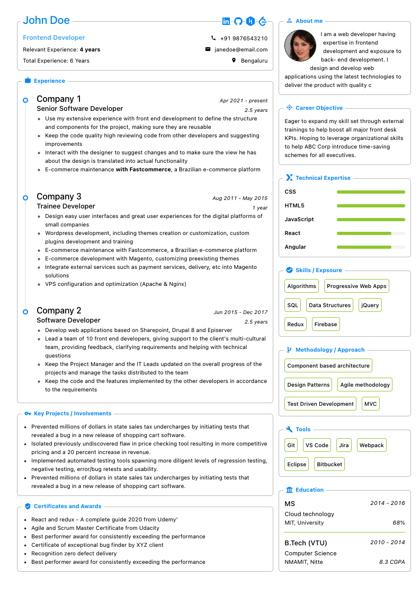
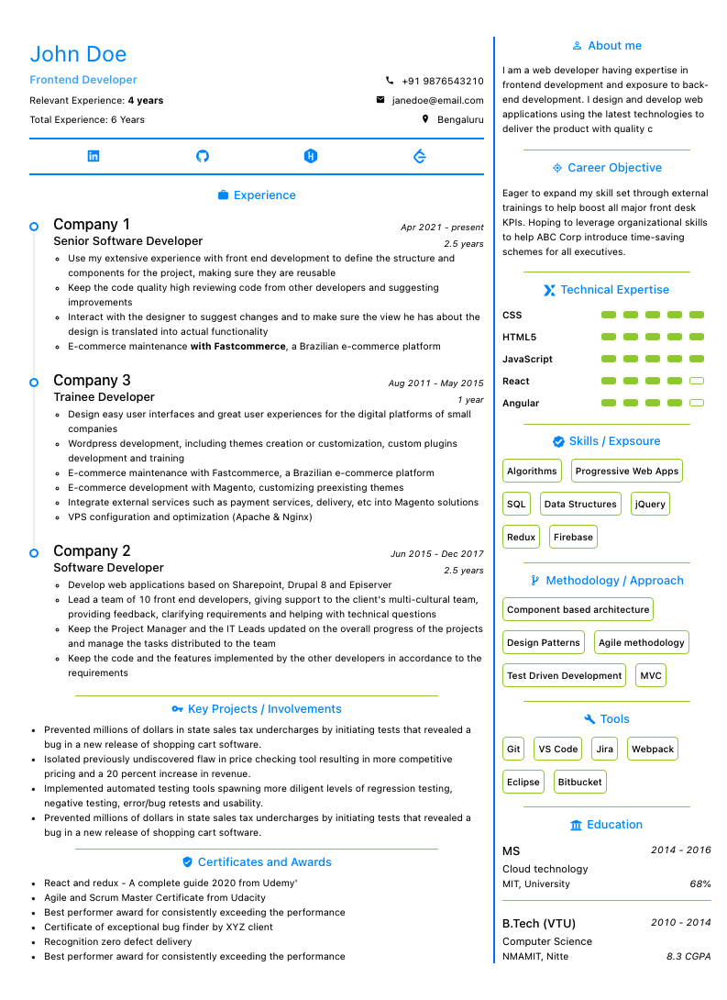

<h1>Problem Statement 3 (QR Based Resume Builder)</h1>

Create a resume builder which can be shared to anyone via a QR Code.

Resume builder with 2 Custom template options which can be downloaded.

Authenticated user can generate QR code which can be shared to view their resumes and download

Saved resume can be viewed and should be editable

Delete Saved resumes

List of Saved resumes.

Resume templates should include Information about the Person, Objective, Projects, Skills, Location, Regards etc.

<h1>Solution</h1>

### Free and fully customizable professional single page resume builder

&nbsp;&nbsp;&nbsp;&nbsp;&nbsp;&nbsp;&nbsp;&nbsp;&nbsp;&nbsp;

### For users

- Replace all the placeholder with you information
- Select the template
- Click on Print and save as PDF. (In case the template is not fitting properly, follow the below recommended settings)
- Orientation: Portrait
- Paper size: A4
- Scale: Fit to width
- Margins: None
- Print headers & footers: Uncheck (remove tick mark)
- Background/graphics: Check (add tick mark)

### Technologies

- [React](https://reactjs.org/) with hooks
- [Styled components](https://styled-components.com/) + [Antd](https://ant.design/docs/react/introduce) (css and component libraries)
- [Zustand](https://github.com/pmndrs/zustand) (hooks based state management library)
- [Next.js](https://nextjs.org/) (Bundler)

